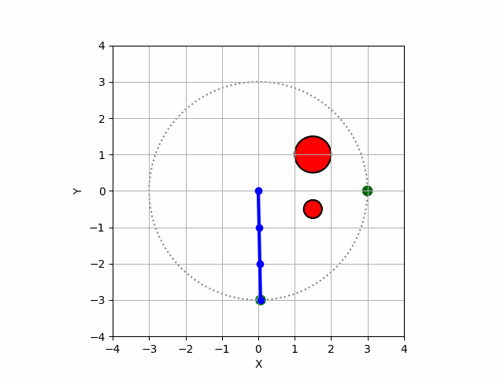

# Motion Planner for a 3-Link 2D Manipulator Robot

This project focuses on the development of a motion planner for a planar robotic arm composed of three revolute joints. The arm operates in a two-dimensional workplace and is capable of navigating around obstacles to reach a desired end-effector position.

This project combines concepts from kinematics, path planning and the discretization of a robot's configuration space. It provides a visual simulation of the robot's motion using matplotlib to visualize the robot's path in an interactive fashion.

Example Product: 

## Project Objectives
- Implement a forward kinematics module to compute the position of each joint given joint angles
- Implement an inverse kinematics solver to compute joint angles given the end-effector's desired pose
- Develop a collision detection system to generate the robot's configuration space
- Implement a pathfinding algorithm to plan a collision-free trajectory in the robot's joint space
- Animate the robot's trajectory for visualization

## Tech Stack
  
  
  
  
  
  
